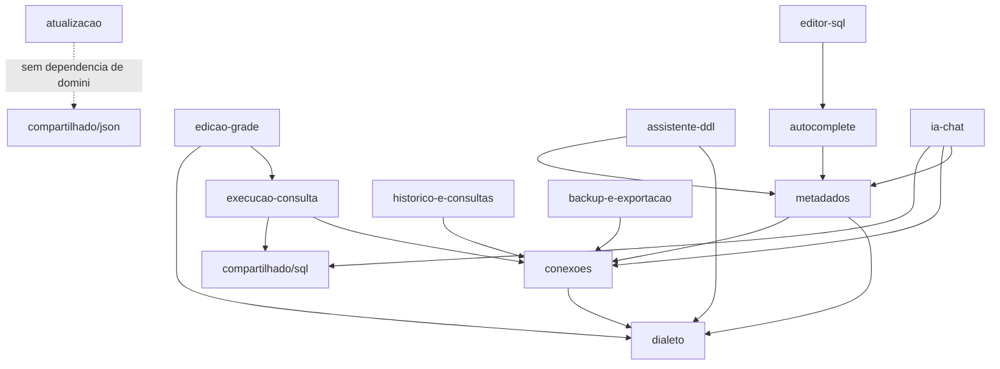

# Arquitetura Alvo e Módulos

## Objetivo

Definir a lista oficial de módulos de domínio do Nureal Database IDE e a estrutura de camadas que cada um deve ter, aplicando [01-Arquitetura/04-estrutura-de-pacotes.md](../../nureal-development-standard/01-Arquitetura/04-estrutura-de-pacotes.md) e [05-Projetos/02-estrutura-de-modulos.md](../../nureal-development-standard/05-Projetos/02-estrutura-de-modulos.md) do NDS a este projeto.

## Motivação

O pacote atual `com.nureal.ide.core` é organizado por feature técnica (`connection`, `metadata`, `autocomplete`...), o que já é um bom começo, mas mistura domínio e infraestrutura dentro do mesmo pacote e não separa `ui/` em módulos correspondentes — hoje `ui/` é praticamente um único pacote plano com ~90 arquivos. É preciso uma lista fechada de módulos e uma estrutura interna padronizada antes de mover qualquer código.

## Pacote raiz

Mantém-se `com.nureal.ide` como raiz (não há motivo para renomear — ver [15-convencoes-e-glossario-do-projeto.md](15-convencoes-e-glossario-do-projeto.md)). Dentro dele, a nova raiz de módulos é `com.nureal.ide.modulos.<nome-do-modulo>`, convivendo com `com.nureal.ide.app` (composition root, ver [13](13-composition-root-e-bootstrap.md)) e `com.nureal.ide.compartilhado` (código genuinamente transversal, ver regra 3 abaixo).

## Lista oficial de módulos

| Módulo | Responsabilidade | Spec |
|---|---|---|
| `conexoes` | Gerenciar perfis de conexão, ciclo de vida da conexão JDBC, cifragem de credenciais | [03](03-modulo-conexoes-e-seguranca.md) |
| `dialeto` | Abstração multi-banco: geração de DDL/DML por vendor | [04](04-modulo-dialeto-e-metadados.md) |
| `metadados` | Leitura e cache da estrutura do banco (schemas/tabelas/colunas/FKs/índices) | [04](04-modulo-dialeto-e-metadados.md) |
| `autocomplete` | Resolução de contexto do cursor + sugestões | [05](05-modulo-autocomplete-e-editor-sql.md) |
| `editor-sql` | Widget de edição de SQL (camada de interface, dividido do god class) | [05](05-modulo-autocomplete-e-editor-sql.md) |
| `execucao-consulta` | Motor de execução de lote de instruções SQL + paginação de resultado | [06](06-modulo-execucao-e-edicao-de-grade.md) |
| `edicao-grade` | Motor de edição/CRUD transacional sobre um resultado de grade | [06](06-modulo-execucao-e-edicao-de-grade.md) |
| `assistente-ddl` | Construção guiada de DDL + sugestões de normalização | [07](07-modulo-assistente-ddl.md) |
| `historico-e-consultas` | Histórico de execução, consultas salvas, sessão de workspace | [08](08-modulo-historico-consultas-sessao.md) |
| `backup-e-exportacao` | Backup/restore via `mysqldump`, exportação para Excel/CSV | [09](09-modulo-backup-exportacao.md) |
| `atualizacao` | Checagem de nova versão via GitHub Releases | [10](10-modulo-atualizacao-app.md) |
| `ia-chat` | Chat com IA, ferramentas (tools), contexto do agente | [11](11-modulo-ia-chat.md) |

## Módulos que permanecem transversais (`compartilhado/`)

Nem todo código merece virar módulo de domínio. Ficam em `com.nureal.ide.compartilhado/`:

- **Design system** (`ui.components` → `compartilhado/designsystem/`): `NButton`, `NCard`, `NTheme`, `NToolbar`, etc. — ver [12](12-interface-design-system-e-dialogos.md).
- **Utilitários de log** (`core.log.AppLogger`): cross-cutting, permanece como utilitário de infraestrutura compartilhado (ver nota sobre logging em [15](15-convencoes-e-glossario-do-projeto.md) — o NDS pede logging estruturado; este projeto usa `java.util.logging` hoje, tratado como débito documentado, não bloqueador desta migração).
- **JSON caseiro** (`core.json.JsonParser`/`JsonWriter`): usado por `ia-chat` (Ollama), `atualizacao` (GitHub API) e pela UI (EXPLAIN FORMAT=JSON). Permanece em `compartilhado/json/` — não é regra de negócio de nenhum módulo específico.
- **Utilitários de SQL puramente textuais** (`core.sql.*`, `core.csv.CsvUtil`, `core.safety.SqlRiskAnalyzer`): usados por múltiplos módulos (`execucao-consulta`, `edicao-grade`, `ia-chat`/`ExecuteSqlTool`, `assistente-ddl`). Permanecem em `compartilhado/sql/`.

## Estrutura interna obrigatória de cada módulo

Todo módulo em `modulos/<nome>/` segue exatamente a estrutura de [05-Projetos/02-estrutura-de-modulos.md](../../nureal-development-standard/05-Projetos/02-estrutura-de-modulos.md) do NDS:

```
modulos/<nome-do-modulo>/
  README.md
  interface/            # painéis/dialogs Swing deste módulo (ex.: ConnectionsPanel)
  aplicacao/
    casos-de-uso/
      <caso-de-uso>/
        <caso-de-uso>.input.java (ou record)
        <caso-de-uso>.output.java
        <caso-de-uso>.handler.java
  dominio/
    entidades/           # records de domínio (ex.: ConnectionProfile, SchemaInfo)
    contratos/           # interfaces que a infraestrutura implementa
  infraestrutura/
    repositorios/        # implementações concretas de persistência
    jdbc/                 # implementações concretas que usam java.sql.*
```

**Adaptação Swing**: diferente de uma API HTTP, a "interface" aqui é sempre Swing. Um painel/dialog na camada `interface/` de um módulo pode invocar diretamente o `Handler` de um caso de uso do mesmo módulo (chamada em memória, mesmo processo) — não há necessidade de tradução de protocolo como em HTTP, mas a regra de [01-Arquitetura/03-fluxo-principal-execucao.md](../../nureal-development-standard/01-Arquitetura/03-fluxo-principal-execucao.md) continua valendo: o painel Swing nunca contém a lógica de negócio, apenas coleta input do usuário, chama o Handler, e traduz o Output em atualização visual (habilitar botão, mostrar diálogo de erro, atualizar grade).

## Regras

1. Nenhum módulo importa a pasta `infraestrutura/` de outro módulo diretamente — comunicação entre módulos segue [01-Arquitetura/08-comunicacao-entre-modulos.md](../../nureal-development-standard/01-Arquitetura/08-comunicacao-entre-modulos.md). Ex.: `edicao-grade` depende de um contrato `ConexaoAtivaPort` exposto por `conexoes`, nunca de `ConnectionManager` diretamente por import cru — ver detalhe em cada spec de módulo sobre quais dependências entre módulos são aceitas como exceção documentada (`dialeto`, por natureza, é dependido por quase todos, o que é esperado de um contrato de domínio transversal).
2. `dialeto` e `metadados` continuam sendo os módulos mais dependidos pelos demais — isso é esperado e correto (são os módulos "fundação"), não um sinal de acoplamento incorreto.
3. Um módulo cujo nome não aparece na tabela acima e cujo código não se qualifica como transversal deve ser tratado como lacuna e registrado antes de decidir onde colocá-lo — ver [09-Evolução/02-lacunas-identificadas.md](../../nureal-development-standard/09-Evolução/02-lacunas-identificadas.md) do NDS.
4. Toda entidade de domínio (`ConnectionProfile`, `SchemaInfo`, `TableInfo`, etc.) mantém-se como `record` imutável, sem anotação de framework — já é o caso hoje, apenas realocar pacote.

## Diagrama de dependências entre módulos



## Exemplos bons

- `edicao-grade` recebendo `ConexaoAtivaPort` e `DatabaseDialect` via construtor de seu Handler, sem importar `com.nureal.ide.modulos.conexoes.infraestrutura.*`.

## Exemplos ruins

- Um módulo novo importando `com.nureal.ide.ui.MainWindow` para "pegar a conexão atual" — sintoma exato do problema descrito em [01-diagnostico-arquitetural-atual.md](01-diagnostico-arquitetural-atual.md).

## Checklist

- [ ] Todo código-fonte existente foi mapeado para exatamente um módulo desta lista ou para `compartilhado/`?
- [ ] Nenhum módulo novo depende da camada `infraestrutura/` de outro módulo diretamente?
- [ ] A estrutura interna de cada módulo segue `interface/aplicacao/dominio/infraestrutura`?
